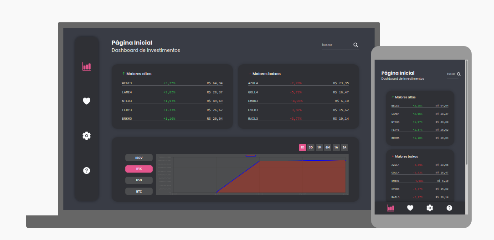

# Dashboard de Investimentos

A [**Dashboard de Investimentos**](https://dashboard-de-investimentos.netlify.app/) facilita a vida do investidor que quer apenas acompanhar as maiores variações do mercado de ações, os principais índices e seus ativos favoritos. Com uma interface simples e direta, o usuário pode ter uma experiência mais agradável para suas consultas rotineiras de acompanhamento.

Este projeto foi desenvolvido durante o curso de Front-end da [Estação Hack from Facebook by Digital House](https://www.digitalhouse.com/br/bolsas/estacao-hack).

  

## Detalhes Técnicos

Este site foi implementado em HTML, CSS e JavaScript puros. Os valores são atualizados a partir de uma API que se conecta a uma tabela do Google Sheets, tendo seus valores fornecidos pelo Google Finance.
